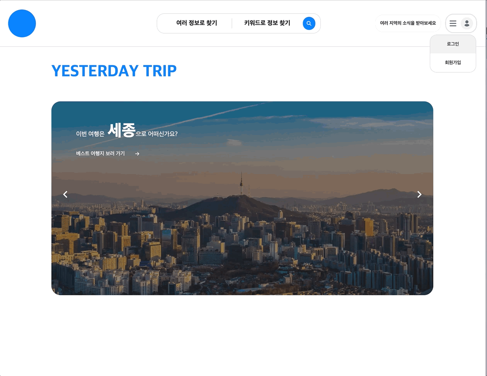
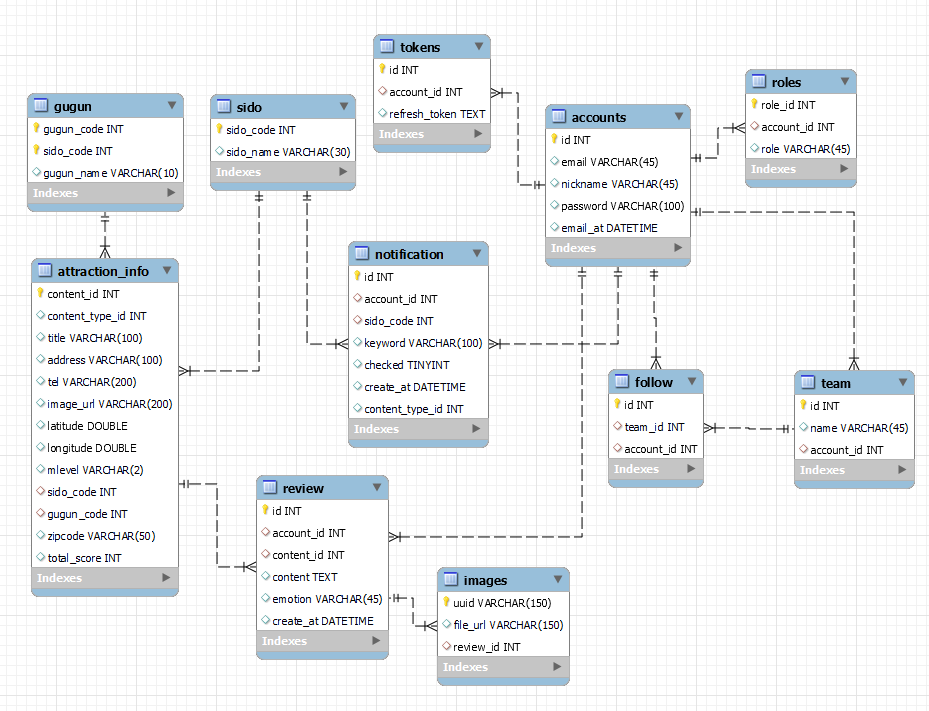

## Yesterday's Trip

### 1. 기획
네이버 지도, 구석구석(축제 일정 제공 서비스)를 사용하며 더 필요하다고 느낀 것
1. 관광지, 축제에 대한 리뷰가 부족
2. 가려고 하는 관광지 근처에 묶어서 갈만한 여행지도 직접 검색 필요
3. 관심있는 지역, 관광지, 축제에 대한 새로운 이벤트도 직접 검색 필요

보완이 필요한 부분을 아래와 같이 해결
1. 네이버 맵과 함께 관광지, 축제에 대한 리뷰 작성 및 조회
2. 지역별 평점이 높고 가까운 관광지 리스트 추천
3. 사용자는 관심있는 지역 팔로우, 지역 관리자가 새로운 관광지 추가시 팔로워들에게 실시간 알림 제공

### 2. 사용 기술

#### 1. back
- spring boot
- spring security
- mysql
- redis
- jwt
- docker
- ec2
- s3

#### 2. front
- vue.js
- pinia
- axios
- scss

### 3. 기능
#### 1. 메인 페이지

로그인과 회원가입 또는 베스트 여행지를 추천해주고, 헤더의 검색창을 통해서 지도 페이지로 이동할 수 있다.

#### 2. 회원가입

회원 가입을 진행할 때 아래와 같은 절차를 검증해야 회원가입을 할 수 있다.
- 이메일 중복 검증
- 해당 이메일로 발송된 인증 코드 검증
#### 3. 로그인

#### 4. 임시비밀번호 발급

만약 비밀번호를 모른다면, 이메일을 입력하고 해당 이메일로 발송된 임시 비밀번호로 로그인 할 수 있다.

#### 5. 컨텐츠 조회, 리뷰 작성

지도 페이지에서는 '시도, 구군, 컨텐츠'타입을 이용해 컨텐츠 조회나, 키워드로 컨텐츠를 조회할 수 있다.
또한 조회한 컨텐츠에대해서 리뷰를 작성도 할 수 있다.

#### 6. 지역 팔로잉

관심있는 지역을 팔로우 할 수 있으며, SSE(Server Sent Event)를 활용해서 팔로우한 시도의 새 컨텐츠의 알람을 즉시 조회할 수 있다.

### 4. ERD

### 5. 후기
1. 협업
    - 팀 프로젝트에서 프론트엔드와의 협업을 처음 경험하면서 파트를 명확히 나누고 목표를 향해 협업하는 방법에 대한 고민이 있었습니다.
    - 같은 기능이라도 백엔드와 프론트엔드 간의 서비스 플로우는 다양하게 분기될 수 있기 때문에 자세한 요구사항과 API 명세서를 통한 소통의 중요성을 깨달았습니다.
2. DB 설계 및 쿼리
    - 동일한 데이터를 API로 받아올지, 무결성과 API 이용비를 고려해 DB에 저장할지에 대한 고민이 있었습니다.
    - ORM(JPA)를 경험한 후 SQL Mapper(Mybatis)를 사용하면서 다음과 같은 깨달음을 얻었습니다
      1. JPA N+1 문제 해결을 위한 fetch join과 같이 Mybatis Collection으로 해결 
      2. 인라인 뷰 쿼리(내부쿼리)에서 메인쿼리(외부쿼리)의 컬럼에 접근 가능
      3. insert values 대신 select 쿼리의 다중행 결과를 이용한 다중 insert 
3. 기능구현을 위한 적절한 기술 조사 및 도입
   - 실시간 알림기능의 경우, 별도의 클라이언트 요청 없이 서버에서 필요한 경우 클라이언트로 요청이 필요했습니다.
   - websocket, polling, long polling, SSE(Server Sent Event) 중 단방향 통신을 지원하고 비교적 학습곡선이 완만해 프로젝트 일정에 맞출 수 있는 SSE를 도입하여 기능을 구현했습니다.
4. 추후과제
   - 새로운 관광지 등록 시에만 사용되는 알림 기능을 기존에 존재하는 관광지에 수정사항이 발생하거나 매년 개최되는 축제의 시작과 같은 이벤트에도 확장할 계획입니다.
   - SSE Connection이 발생하는 사용자 수만큼 줄이기 위해 Message Queue를 사용하는 방안을 고려 중입니다.