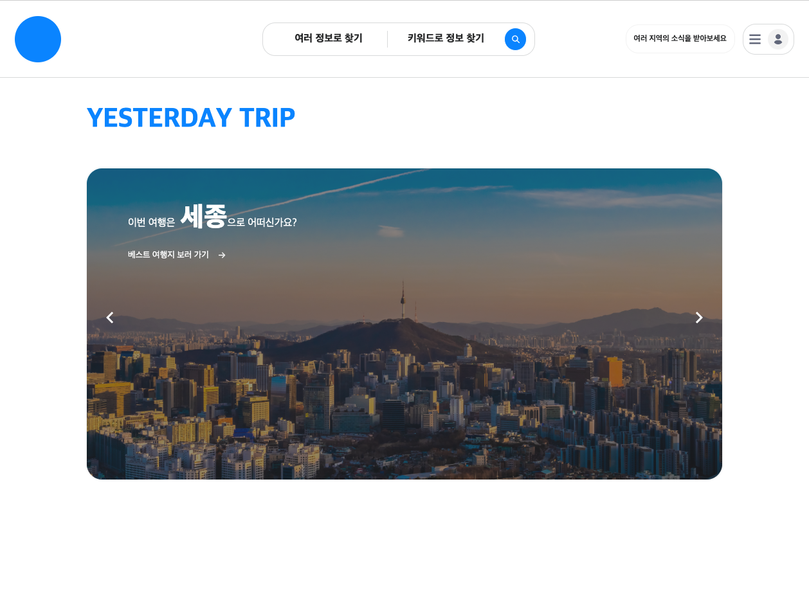

## Yesterday's Trip

### 1. 기획
네이버 지도, 구석구석(축제 일정 제공 서비스)를 사용하며 더 필요하다고 느낀 것
- 관광지, 축제에 대한 리뷰가 부족
- 가려고 하는 관광지 근처에 묶어서 갈만한 여행지도 직접 검색 필요
- 관심있는 지역, 관광지, 축제에 대한 새로운 이벤트도 직접 검색 필요

보완이 필요한 부분을 아래와 같이 해결
1. 네이버 맵과 함께 관광지, 축제에 대한 리뷰 작성 및 조회
2. 지역별 평점이 높고 가까운 관광지 리스트 추천
3. 사용자는 관심있는 지역 팔로우, 지역 관리자가 새로운 관광지 추가시 팔로워들에게 실시간 알림 제공

### 2. 사용 기술

#### 1. back
- spring boot
- spring security
- mysql
- redis
- jwt
- docker
- ec2
- s3

#### 2. front
- vue.js
- pinia
- axios
- scss

### 3. 기능
#### 1. 메인 페이지

로그인과 회원가입 또는 베스트 여행지를 추천해주고, 헤더의 검색창을 통해서 지도 페이지로 이동할 수 있다.

#### 2. 회원가입

