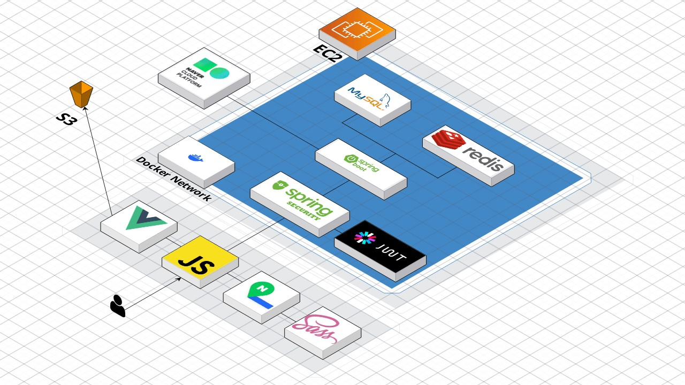
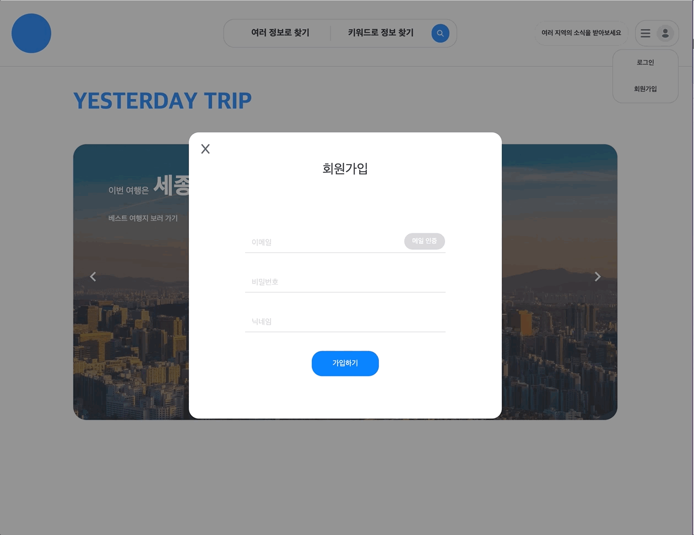
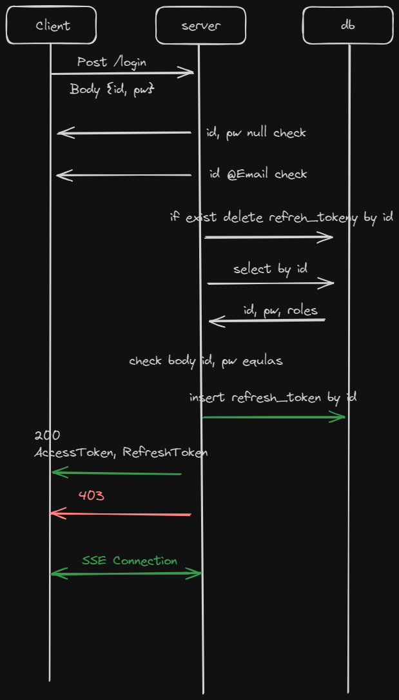

<!--
Hey, thanks for using the awesome-readme-template template.  
If you have any enhancements, then fork this project and create a pull request 
or just open an issue with the label "enhancement".

Don't forget to give this project a star for additional support ;)
Maybe you can mention me or this repo in the acknowledgements too
-->
<div>

  <h1>Yesterday's Trip</h1>

  ---
  <p>
    관광지, 축제에 관한 지도 기반 웹 서비스입니다. 
  </p>
<br />


<!-- TechStack -->
## 사용한 메인 라이브러리

---
- Java 8
- Spirng Boot 2.7.17
- Spring Security/JWT
- MySQL
- Redis
- MyBatis
- AWS S3, EC2
- Docker

## 프로젝트 실행

---
- mysql
  - `db.url`
  - `db.port`
  - `db.db`
  - `db.username`
  - `db.password`

- redis
  - `redis.host`
  - `redis.port`

- 공공 데이터 API
  - `api.data`

- Naver API
  - Clover
    - `api.naver.id`
    - `api.naver.secret`
    - `api.naver.url`
  - Map
    - `api.naver.map.url`
- S3
  - `api.s3.id`
  - `api.s3.secret`
  - `api.s3.url`
  - `api.s3.bucket`

```bash
 mvn clean compile package
 
 java -jar -Dapi.data=api.key
-Dapi.naver.id=api.naver.ic -Dapi.naver.map.url=api.naver.map.url
-D api.naver.secret=api.naver.secret -Dapi.naver.url=api.naver.url
-D api.s3.id=s3.id -Dapi.s3.secret=s3.secret -Dapi.s3.url=s3.url
-Ddb.password=db.passowrd -Ddb.port=db.port -Ddb.url=db.url -Ddb.username=db.usernmae -Dmail.password=mail.password -Dmail.username=mail.usernmae -Dredis.host=redie.host -Dredis.port=redis.port target/*.jar 
 
```

## 배포 및 아키텍처

---



<!-- Screenshots -->
## 기능

### 지역 팔로잉

---


관심있는 지역을 팔로우 할 수 있으며, SSE(Server Sent Event)를 활용해서 팔로우한 시도의 새 컨텐츠의 알람 조회

### 컨텐츠 조회, 리뷰 작성

---


지도 페이지에서는 '시도, 구군, 컨텐츠' or 키워드 조회
조회한 컨텐츠에 대한 리뷰 작성


### 회원가입

---


회원 가입 검증 절차
- 이메일 중복 검증
- 해당 이메일로 발송된 인증 코드 검증

### 로그인

---



### 기획
네이버 지도, 구석구석(축제 일정 제공 서비스)를 사용하며 더 필요하다고 느낀 것
1. 관광지, 축제에 대한 리뷰가 부족
2. 가려고 하는 관광지 근처에 묶어서 갈만한 여행지도 직접 검색 필요
3. 관심있는 지역, 관광지, 축제에 대한 새로운 이벤트도 직접 검색 필요

보완이 필요한 부분을 아래와 같이 해결
1. 네이버 맵과 함께 관광지, 축제에 대한 리뷰 작성 및 조회
2. 지역별 평점이 높고 가까운 관광지 리스트 추천
3. 사용자는 관심있는 지역 팔로우, 지역 관리자가 새로운 관광지 추가시 팔로워들에게 실시간 알림 제공


## ERD

