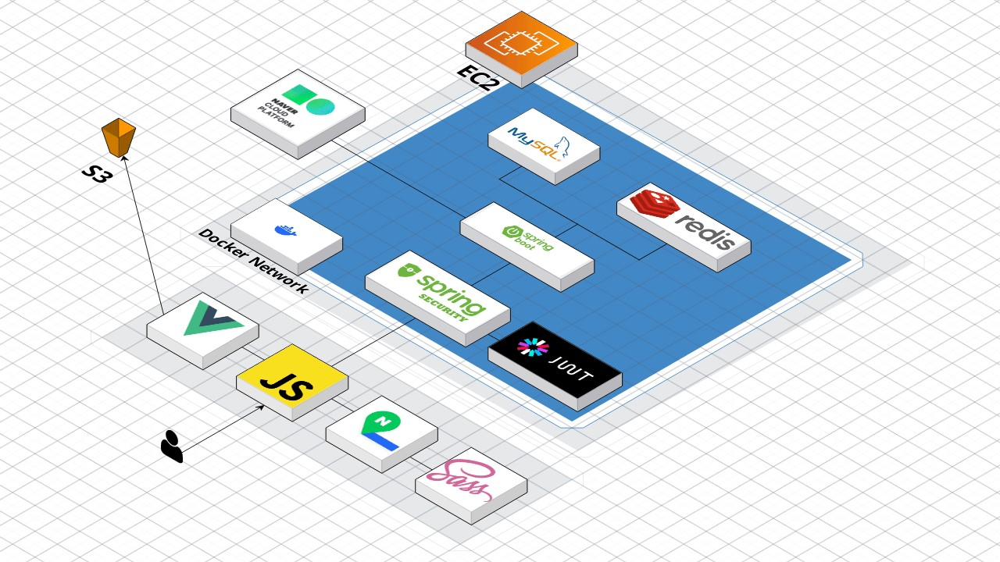
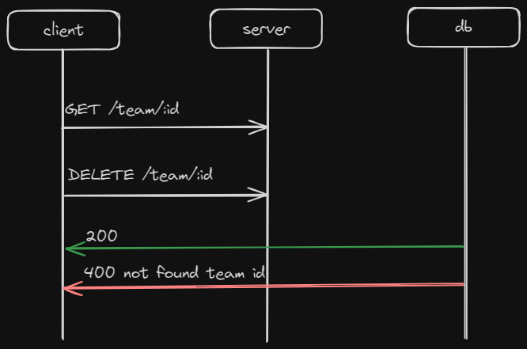
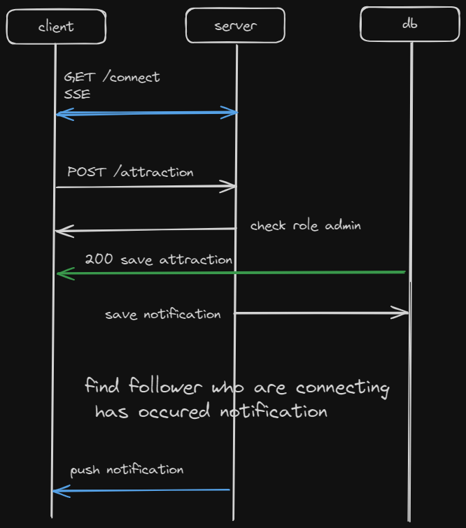
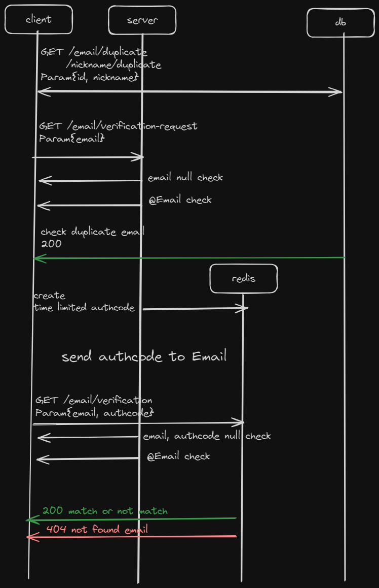
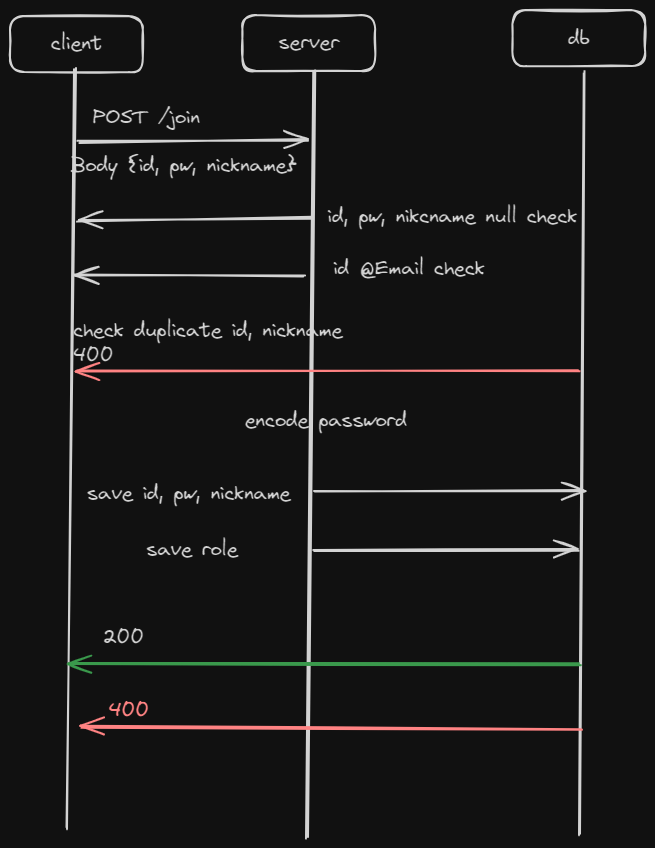
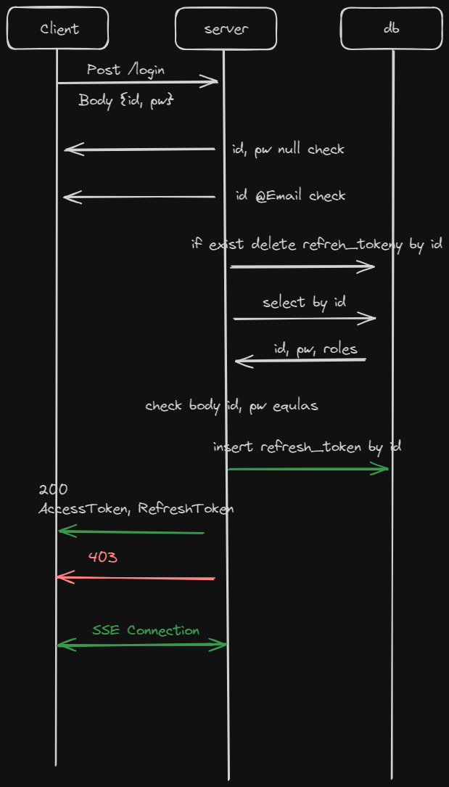
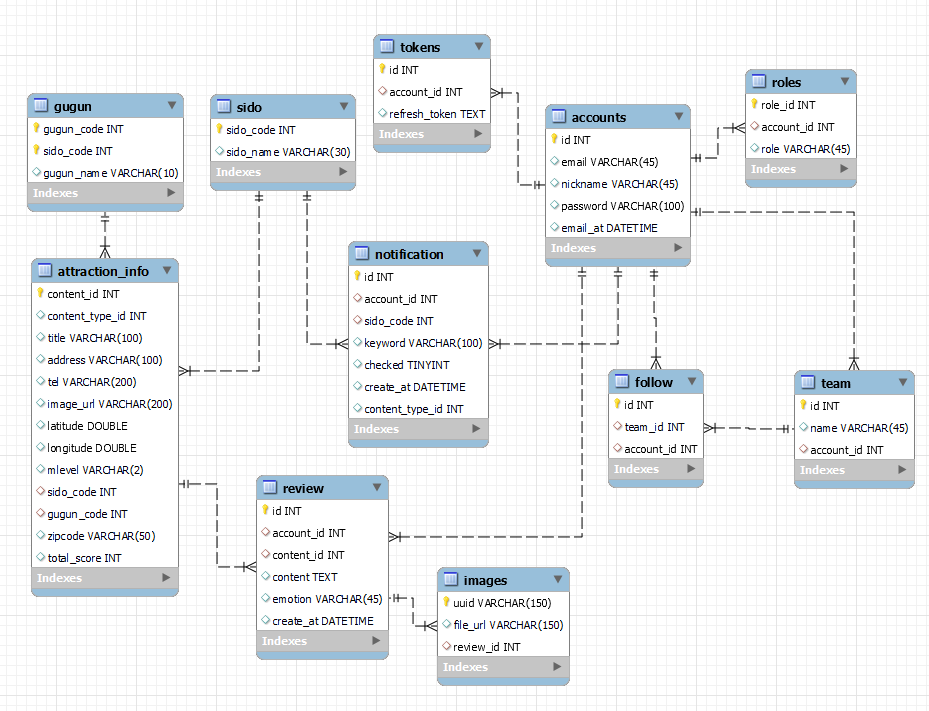

<!--
Hey, thanks for using the awesome-readme-template template.  
If you have any enhancements, then fork this project and create a pull request 
or just open an issue with the label "enhancement".

Don't forget to give this project a star for additional support ;)
Maybe you can mention me or this repo in the acknowledgements too
-->
<div>

  <h1>Yesterday's Trip</h1>

  <p>
    관광지, 축제에 관한 지도 기반 웹 리뷰 서비스입니다. 
  </p>
<p>
    관광지, 축제의 평점 확인, 리뷰 작성 및 조회, 평점 높고 거리가 가까운 여행지들을 추천합니다.
  </p>
  <p>
    관심있는 지역을 팔로우하고 새로운 관광지 추가시 실시간 알림도 받아볼 수 있습니다. 
  </p>
<br />


<!-- TechStack -->
## 사용한 메인 라이브러리

- Java 8
- Spirng Boot 2.7.17
- Spring Security/JWT
- MySQL
- Redis
- MyBatis
- AWS S3, EC2
- Docker

## 프로젝트 실행


- mysql
  - `db.url`
  - `db.port`
  - `db.db`
  - `db.username`
  - `db.password`

- redis
  - `redis.host`
  - `redis.port`

- 공공 데이터 API
  - `api.data`

- Naver API
  - Clover
    - `api.naver.id`
    - `api.naver.secret`
    - `api.naver.url`
  - Map
    - `api.naver.map.url`
- S3
  - `api.s3.id`
  - `api.s3.secret`
  - `api.s3.url`
  - `api.s3.bucket`

```bash
 mvn clean compile package
 
 java -jar -Dapi.data=api.key
-Dapi.naver.id=api.naver.ic -Dapi.naver.map.url=api.naver.map.url
-Dapi.naver.secret=api.naver.secret -Dapi.naver.url=api.naver.url
-Dapi.s3.id=s3.id -Dapi.s3.secret=s3.secret -Dapi.s3.url=s3.url
-Ddb.password=db.passowrd -Ddb.port=db.port -Ddb.url=db.url -Ddb.username=db.usernmae -Dmail.password=mail.password -Dmail.username=mail.usernmae -Dredis.host=redie.host -Dredis.port=redis.port target/*.jar 
 
```

## 배포 및 아키텍처





<!-- Screenshots -->
## 메인 화면

### 지역 팔로잉


관심있는 지역을 팔로우 할 수 있으며, SSE(Server Sent Event)를 활용해서 팔로우한 시도의 새 컨텐츠의 알람 조회 할 수 있습니다.

### 컨텐츠 조회, 리뷰 작성


지도 페이지에서는 '시도, 구군, 컨텐츠' or 키워드 조회
조회한 컨텐츠에 대한 리뷰 작성을 할 수 있습니다.


## 시퀀스 다이어그램
### 지역 팔로잉 & 실시간 알림



### 회원가입




### 로그인



## 문제 & 해결

### 쿼리압축
[블로그 포스팅](https://anythingis.tistory.com/167)
- 서버와 DB 커넥션 비용을 줄이기 위한 쿼리 압축을 진행했습니다.
  - N+1 문제 해결을 위한 Mybatis Collection
  - INSERT INTO ~ SELECT
  - Mybatis 동적쿼리

### SSE 실시간 알림
[블로그 포스팅](https://anythingis.tistory.com/168)
- 서버에서 클라이언트로 단방향 알림푸쉬 통신을 위한 SSE Connection 기술을 사용했습니다
  - polling, long polling, websocket, sse 등의 기술 중 원하는 기능 구현에 맞는 기술을 조사하고 선택했습니다.
  - 메모리로 관리하는 SSE 사용을 위한 Thread Safe 자료구조 사용했습니다.

## ERD

